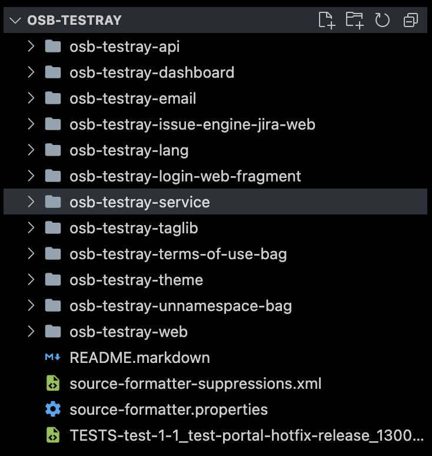
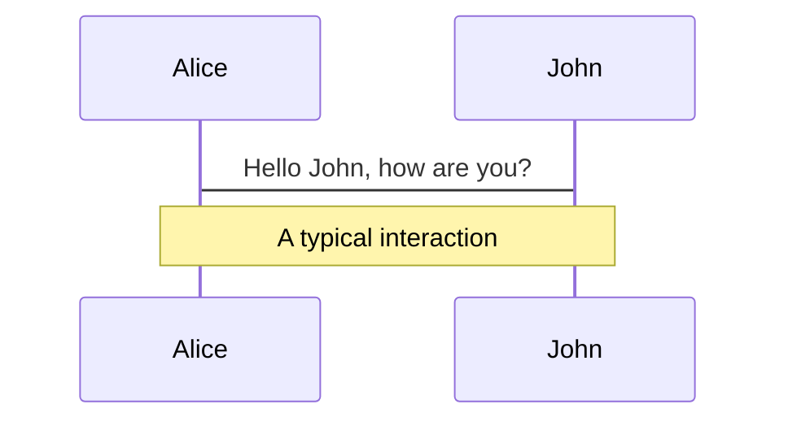
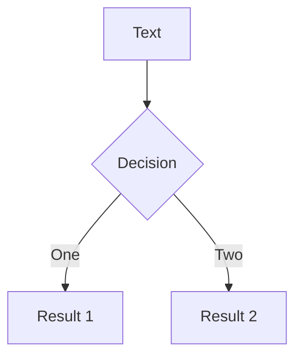
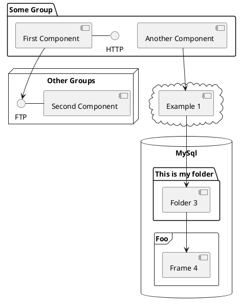

---
# try also 'default' to start simple
theme: seriph
# random image from a curated Unsplash collection by Anthony
# like them? see https://unsplash.com/collections/94734566/slidev
background: https://images.unsplash.com/photo-1668889311480-95cbd4d5c9cd?ixlib=rb-4.0.3&ixid=MnwxMjA3fDB8MHxwaG90by1wYWdlfHx8fGVufDB8fHx8&auto=format&fit=crop&w=2340&q=80
# apply any windi css classes to the current slide
class: 'text-center'
# https://sli.dev/custom/highlighters.html
highlighter: shiki
# show line numbers in code blocks
lineNumbers: false
# some information about the slides, markdown enabled
info: |
  ## Slidev Starter Template
  Presentation slides for developers.

  Learn more at [Sli.dev](https://sli.dev)
# persist drawings in exports and build
drawings:
  persist: false
# use UnoCSS
css: unocss
---

# Testray dev/24

Behind Testray 2, how we are rewriting a software using 7.4

<div class="pt-12">
  <span @click="$slidev.nav.next" class="px-2 py-1 rounded cursor-pointer" hover="bg-white bg-opacity-10">
    Press Space for next page <carbon:arrow-right class="inline"/>
  </span>
</div>

<div class="abs-br m-6 flex gap-2">
  <button @click="$slidev.nav.openInEditor()" title="Open in Editor" class="text-xl icon-btn opacity-50 !border-none !hover:text-white">
    <carbon:edit />
  </button>
  <a href="https://github.com/slidevjs/slidev" target="_blank" alt="GitHub"
    class="text-xl icon-btn opacity-50 !border-none !hover:text-white">
    <carbon-logo-github />
  </a>
</div>

<!--
The last comment block of each slide will be treated as slide notes. It will be visible and editable in Presenter Mode along with the slide. [Read more in the docs](https://sli.dev/guide/syntax.html#notes)
-->

---

# What is Testray?

Testray is a simple and powerful Test Management SAAS application which offers a robust solution to effectively analyze test results in an intuitive and actionable way.

Using a simple interface and a prosperous import feature, integrating with tests written in Poshi, Testray allows your test team to get started immediately, presenting test results grouped for quick analysis and action.

Testray was written with the following spects

- 📝 **Platform** - Liferay Portal 7.1
- 🤹 **Application** - Portlet based, Testray works as MVC Project.
- 🎨 **Theme** - Liferay Themelets used with npm packages
- 🎲 **Database** - Database Access with Service Builder Modules
- 🧶 **Stack** - Java, JSP

<br>
<br>

Read more about [Portlets](https://help.liferay.com/hc/en-us/articles/360017885732-Introduction-to-Portlets), 
[Themelets](https://help.liferay.com/hc/en-us/articles/360017882992-Themelets-) and
[Service Builder](https://help.liferay.com/hc/en-us/articles/360017886532-What-is-Service-Builder-#:~:text=Liferay%20Service%20Builder%20is%20a,code%20for%20the%20underlying%20database.)

<!--
You can have `style` tag in markdown to override the style for the current page.
Learn more: https://sli.dev/guide/syntax#embedded-styles
-->

<style>
h1 {
  background-color: #2B90B6;
  background-image: linear-gradient(45deg, #4EC5D4 10%, #146b8c 20%);
  background-size: 100%;
  -webkit-background-clip: text;
  -moz-background-clip: text;
  -webkit-text-fill-color: transparent;
  -moz-text-fill-color: transparent;
}
</style>

<!--
Here is another comment.
-->

---

# 7.1 Module Structure

This structure is pretty common for Liferay Projects beforer 7.4, all the modules serve on specific purpose, Java knowledge is important to write and configure then.


<div grid="~ cols-2">
  <div>
    
  </div>
    
  <div>

  ### Important modules

  |     |     |
  | --- | --- |
  | osb-testray-api | TBD |
  | osb-testray-service | TBD |
  | osb-testray-taglib | TBD |
  | osb-testray-theme | TBD |
  | osb-testray-web | TBD |
  </div>
</div>

--- #4

# 7.4 with Site Initializer

Testray 2.0 relies on Site Initializer to provide all the assets and structure necessary to use on 7.4

With Site Initializer we do:

<v-clicks>

  - Create the Site.
  - Create Object Definition, Relationships, Populate Data, add PickList and more.
  - Define Layout Configuration, Fragments, Stylebook.
  - Define Roles and assign permissions to then.
  - Create Documents in Documents and Media.
  - Create Client Extension.
  
</v-clicks>

<span v-after>

  And so much more can be done with Site Initializer, but those features attend our needs for now.

</span>

---

# Object Definition

Example of Testray Project Object definition

<div grid="~ cols-2 gap-4">

<div>

```json {all|2-4|5|6-16|17-19|20|all} 
{
	"label": {
		"en_US": "Testray Project"
	},
	"name": "Project",
	"objectFields": [
		{
			"indexed": true,
			"label": {
				"en_US": "Name"
			},
			"name": "name",
			"required": true,
			"type": "String"
		}
	],
	"pluralLabel": {
		"en_US": "Testray Projects"
	},
	"scope": "company",
}
```

</div>

<div>
  <span v-click="1">

  - Object Definition Friendly Name

  </span>

  <span v-click="2">

  - Object Name Friendly Name

  </span>

  <span v-click="3">

  - This array can be used to map all **columns** used in Object Definition, in this case we are mapping the name as ```string, indexable and required```.

  </span>

  <span v-click="4">

  - Same as 2 but Pluralized

  </span>

  <span v-click="5">

  - Scope can be "Site" | "Company"
    - Site scopes the data by the current site that you are accessing, you must pass the siteId to the request, if you have multiple sites, you cannot read from other.
    - Company scopes means that, all sites inside this company can share the data. 

  </span>
</div>

</div>

[^1]: [Learn More](https://sli.dev/guide/syntax.html#line-highlighting)

<style>
.footnotes-sep {
  @apply mt-20 opacity-10;
}
.footnotes {
  @apply text-sm opacity-75;
}
.footnote-backref {
  display: none;
}
</style>

---

# Testray 2.0

qwekoqwjekqwsdasd


---


# Testray 2.0 React EntryPoint

```ts 
class Testray extends HTMLElement {
	connectedCallback() {
		createRoot(this).render(
			<SWRConfig>
				<ApplicationContextProvider
					properties={{
						jiraBaseURL: this.getAttribute('jiraBaseURL') || '',
					}}
				>
					<ClayIconProvider>
						<TestrayRouter />
					</ClayIconProvider>
				</ApplicationContextProvider>
			</SWRConfig>
		);
	}
}

if (!customElements.get("liferay-remote-app-testray")) {
	customElements.define("liferay-remote-app-testray", Testray);
}
```

[^1]: [Learn More](https://sli.dev/guide/syntax.html#line-highlighting)

--- 

# Components

<div grid="~ cols-2 gap-4">
<div>

You can use Vue components directly inside your slides.

We have provided a few built-in components like `<Tweet/>` and `<Youtube/>` that you can use directly. And adding your custom components is also super easy.

```html
<Counter :count="10" />
```

<!-- ./components/Counter.vue -->
<Counter :count="10" m="t-4" />

Check out [the guides](https://sli.dev/builtin/components.html) for more.

</div>
<div>

```html
<Tweet id="1390115482657726468" />
```

<Tweet id="1390115482657726468" scale="0.65" />

</div>
</div>

<!--
Presenter note with **bold**, *italic*, and ~~striked~~ text.

Also, HTML elements are valid:
<div class="flex w-full">
  <span style="flex-grow: 1;">Left content</span>
  <span>Right content</span>
</div>
-->


---
class: px-20
---

# Themes

Slidev comes with powerful theming support. Themes can provide styles, layouts, components, or even configurations for tools. Switching between themes by just **one edit** in your frontmatter:

<div grid="~ cols-2 gap-2" m="-t-2">

```yaml
---
theme: default
---
```

```yaml
---
theme: seriph
---
```


</div>

Read more about [How to use a theme](https://sli.dev/themes/use.html) and
check out the [Awesome Themes Gallery](https://sli.dev/themes/gallery.html).

---
preload: false
---

# Animations

Animations are powered by [@vueuse/motion](https://motion.vueuse.org/).

```html
<div
  v-motion
  :initial="{ x: -80 }"
  :enter="{ x: 0 }">
  Slidev
</div>
```

<div class="w-60 relative mt-6">
  <div class="relative w-40 h-40">
    
    
    
  </div>

  <div
    class="text-5xl absolute top-14 left-40 text-[#2B90B6] -z-1"
    v-motion
    :initial="{ x: -80, opacity: 0}"
    :enter="{ x: 0, opacity: 1, transition: { delay: 2000, duration: 1000 } }">
    Slidev
  </div>
</div>

<!-- vue script setup scripts can be directly used in markdown, and will only affects current page -->
<script setup lang="ts">
const final = {
  x: 0,
  y: 0,
  rotate: 0,
  scale: 1,
  transition: {
    type: 'spring',
    damping: 10,
    stiffness: 20,
    mass: 2
  }
}
</script>

<div
  v-motion
  :initial="{ x:35, y: 40, opacity: 0}"
  :enter="{ y: 0, opacity: 1, transition: { delay: 3500 } }">

[Learn More](https://sli.dev/guide/animations.html#motion)

</div>

---

# LaTeX

LaTeX is supported out-of-box powered by [KaTeX](https://katex.org/).

<br>

Inline $\sqrt{3x-1}+(1+x)^2$

Block
$$
\begin{array}{c}

\nabla \times \vec{\mathbf{B}} -\, \frac1c\, \frac{\partial\vec{\mathbf{E}}}{\partial t} &
= \frac{4\pi}{c}\vec{\mathbf{j}}    \nabla \cdot \vec{\mathbf{E}} & = 4 \pi \rho \\

\nabla \times \vec{\mathbf{E}}\, +\, \frac1c\, \frac{\partial\vec{\mathbf{B}}}{\partial t} & = \vec{\mathbf{0}} \\

\nabla \cdot \vec{\mathbf{B}} & = 0

\end{array}
$$

<br>

[Learn more](https://sli.dev/guide/syntax#latex)

---

# Diagrams

You can create diagrams / graphs from textual descriptions, directly in your Markdown.

<div class="grid grid-cols-3 gap-10 pt-4 -mb-6">







</div>

[Learn More](https://sli.dev/guide/syntax.html#diagrams)

---
src: ./pages/multiple-entries.md
hide: false
---

---
layout: center
class: text-center
---

# Learn More

[Documentations](https://sli.dev) · [GitHub](https://github.com/slidevjs/slidev) · [Showcases](https://sli.dev/showcases.html)
